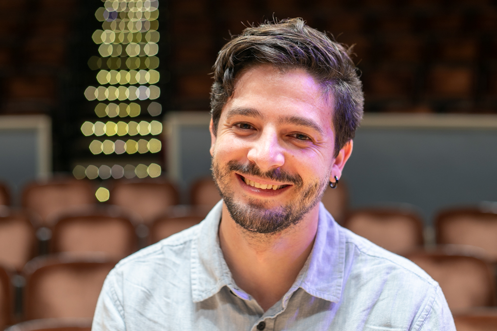

{: .about-image }

I am a music technologist, composer, and improviser from Chile. My research interests lie at the intersection of immersive media and musical practice, working on designing interactive music environments with virtual reality systems and the creation of 3D virtual environments as scores for musical performance. My work has been presented in festivals and conferences such as SEAMUS, NIME, the SF Tape Music Festival, Cube Fest, CAMPGround and the Performing Media Festival. I graduated with a BFA from the Music Technology program at Universidad de Chile, and a Master’s in Media Arts from the University of Michigan. At Michigan, I focused on creating a movement-based interactive music performance using motion capture technology. In Santiago, Chile, I worked as a recording engineer and sound designer, where I also collaborated on various multi-disciplinary projects involving dance, theater, and visual arts. I am currently a Ph.D. candidate in the Composition and Computer Technologies program at the University of Virginia.