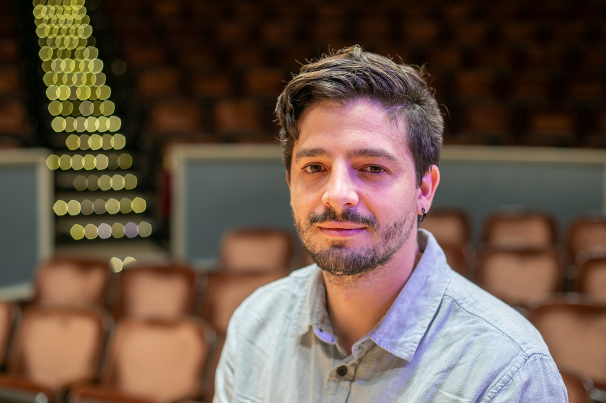

{: .about-image }

Matias Vilaplana Stark is a Chilean music technologist, composer, and improviser. His research interests lie at the intersection of immersive media and musical practice, working on designing interactive music environments with virtual reality systems and the creation of 3D virtual environments as graphic scores for musical improvisation. His work has been presented in festivals and conferences such as SEAMUS, NIME, the SF Tape Music Festival, CAMPGround and Performing Media Festival. He holds a BFA from the Music Technology program at Universidad de Chile, and a Master’s in Media Arts from the University of Michigan. In Santiago, he worked as a recording engineer and sound designer, collaborating with the artistic fields of dance, theater and visual arts in various projects. At Michigan, he focused on creating movement-based interactive musical systems using motion capture technology. He is currently a Ph.D. candidate in the Composition and Computer Technologies program at the University of Virginia.

I intend to create a sense of presence in my music, a sonic world that contains living beings, natural elements and artificial processes. Together, these sounds create an immersive experiencea through spatialized sound, inviting listeners to places we have never experienced. But how to compose a new sonic world? How to evoke a place that one has never been to before? I take inspiration in soundwalks, narrative structures, and ideas of magical realism to imagine what inhabits these places. Although music can not describe places or actions in the same way as words can, the dialogue between the different sonic materials can appeal to our imagination and invite us to participate through active listening, weaving together the sounds into a narrative of our own. In some of my pieces, such as Funeral For a Whale, or To Those Who Leave, field recordings, sound synthesis and samples from musical instruments are combined through different processing and editing techniques to blur the lines between real-world and abstract sounds to produce fictional soundscapes that cross over into the magical realm. A recording of a mechanical machine can be turned into an animal, the sound of the wind can produce a melody. Taking advantage of our capacity to listen in a referential manner – being able to identify sound sources quickly: a car motor, a dog, a person running – I shape the forms and trajectories of these sonic worlds by playing with this way of listening, transforming and shifting sonic material through time and space to create a place that is strange but familiar, a scene that we can relate to, but yet have never experienced before.