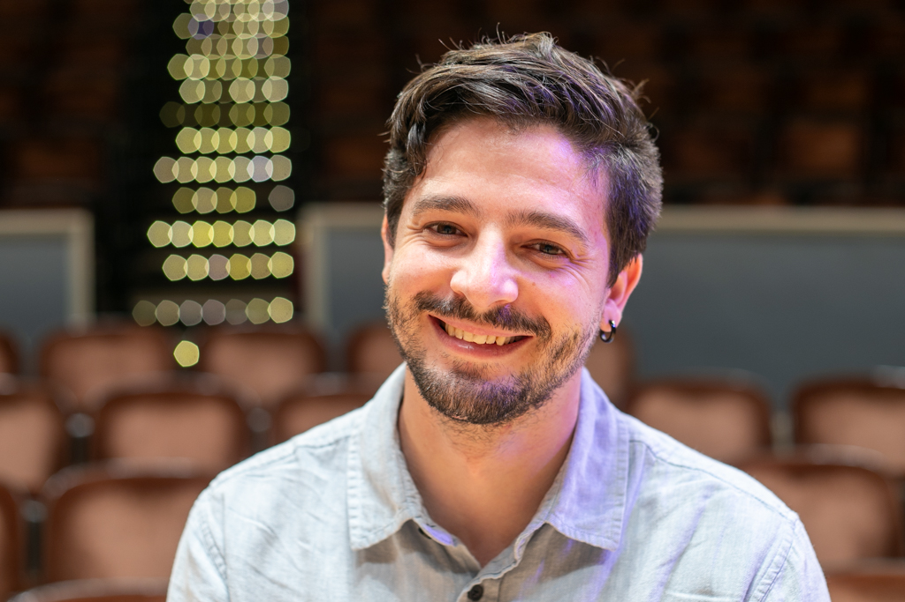

{: .about-image }

Matias Vilaplana Stark is a music technologist, composer, improviser, and educator from Chile.  His research interests lie at the intersection of immersive media and musical practice. In his work, he designs interactive systems for musical performance with virtual reality, composes multi-channel tape pieces for immersive sound systems, and improvises electronic music with custom digital/analog configurations. His work has been presented in festivals and conferences such as SEAMUS, NIME, IEEE VR, the SF Tape Music Festival, Cube Fest, CAMPGround and the Performing Media Festival, and has collaborated with different ensembles including Ensemble Dal Niente, Tokyo Gen'On Project, Audiovisual Collective, Popebama, New Thread Quartet, and Hypercube. He also worked as a recording and mixing engineer at Estudios Agartha in Santiago, Chile, where he collaborated as a sound designer on various interdisciplinary projects involving dance, theater, and visual arts.

email: mav2nd@virginia.edu
ig: mati_v.s
